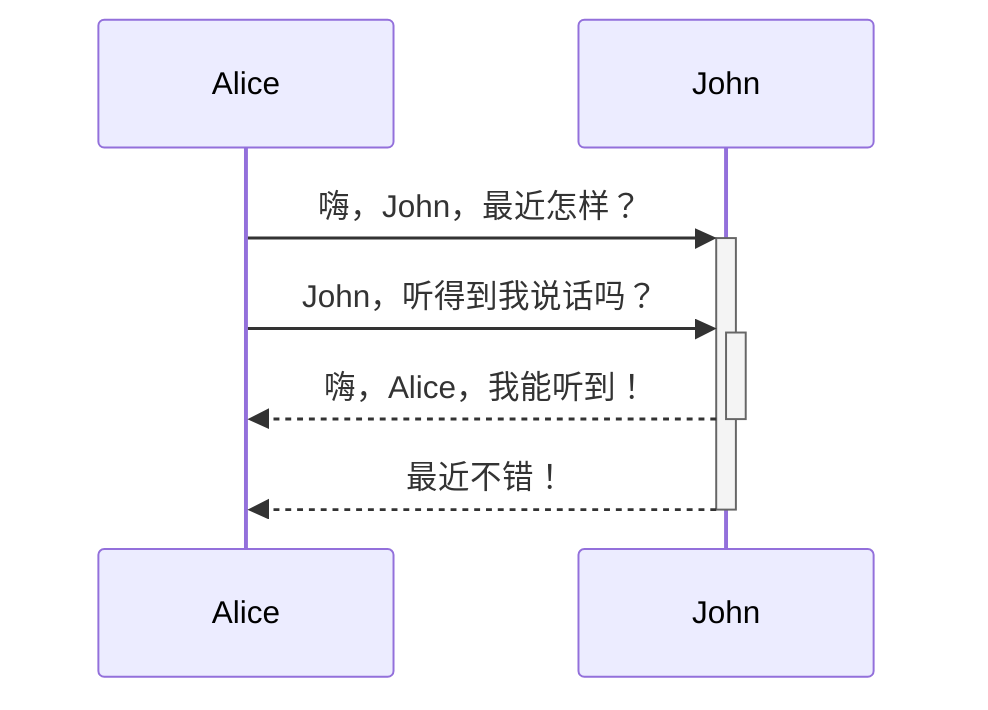

author:: null
source:: [格式化你的笔记 by ob官方 - Obsidian中文教程](https://publish.obsidian.md/chinesehelp/06+ob%E5%AE%98%E6%96%B9%E5%B8%AE%E5%8A%A9%E6%96%87%E6%A1%A3%EF%BC%88%E8%8A%82%E9%80%89%EF%BC%89/%E6%A0%BC%E5%BC%8F%E5%8C%96%E4%BD%A0%E7%9A%84%E7%AC%94%E8%AE%B0+by+ob%E5%AE%98%E6%96%B9)
clipped:: [[2022-06-23]]
published:: 

#稍后阅读

```
title: 
uid: 202108060738
aliases: []
tags: []
from: 
```

Obsidian 是一个基于 Markdown 进行记录的知识库软件。

目前 Obsidian 支持的格式如下：

在笔记中插入其他文件（更多细节请阅读[嵌入文件](https://publish.obsidian.md/chinesehelp/%E5%B5%8C%E5%85%A5%E6%96%87%E4%BB%B6)）。这里将演示如何插入一篇笔记的某个章节：

```
![[Obsidian#什么是 Obsidian]]
```

obsidian

```
title: 
uid: 202107122234
aliases: []
tags: []
from: 
```

在本文档中，obsidian是值基于[electron](https://publish.obsidian.md/chinesehelp/01+2021%E6%96%B0%E6%95%99%E7%A8%8B/electron)一款笔记软件。  
其他的含义有黑曜石，是一种矿石，可见于许多游戏中。

```
# 这是小标题 1
## 这是小标题 2
### 这是小标题 3 
#### 这是小标题 4
##### 这是小标题 5
###### 这是小标题 6
```

*这是斜体示例*  
*这是斜体的另一种写法*

```
**这是粗体示例**
__这是粗体的另一种写法__
```

**这是粗体示例**  
**这是粗体的另一种写法**

*你也**可以**将它们配合使用*

```
- 项目 1
- 项目 2
	- 项目 2a
	- 项目 2b

1. 项目 1
1. 项目 2
1. 项目 3
   1. 项目 3a
   1. 项目 3b
```

无序列表：

有序列表：

1.  项目 1
2.  项目 2
3.  项目 3
    1.  项目 3a
    2.  项目 3b

```

```


比如，将上面的示例图片调整为100像素宽：

```

```


Markdown 风格的链接既可以用来指向网页这类外部对象，也可以用来指向库中的笔记或者图片。

```
http://obsidian.md - automatic!
[Obsidian](http://obsidian.md)
```

[Obsidian URI](https://publish.obsidian.md/chinesehelp/%E4%BD%BF%E7%94%A8+Obsidian+URI) 可以让你在其他应用或 Obsidian 的其他库中打开当前库的某篇笔记。

比如，你可以通过以下方式跳转到某个库中的某篇笔记（请注意 [URI 的编码](https://publish.obsidian.md/chinesehelp/%E4%BD%BF%E7%94%A8+Obsidian+URI#%E7%BC%96%E7%A0%81)）：

```
[打开某篇笔记](obsidian://open?path=D:%2Fpath%2Fto%2Ffile.md)
```

除了通过笔记的地址来链接笔记外，你也可以通过笔记所在的库名称以及笔记名称来链接该笔记：

```
[打开某篇笔记](obsidian://open?vault=MainVault&file=MyNote.md)
```

如果 url 中含有空格的话，空格需要转义为 `%20`，如：

```
[Export options](Pasted%20image)
```

当然，你也可以用 `<>` 将空格包含起来，如：

```
[Slides Demo](<Slides Demo>)
```

```
> Human beings face ever more complex and urgent problems, and their effectiveness in dealing with these problems is a matter that is critical to the stability and continued progress of society.

\- Doug Engelbart, 1961
```

> Human beings face ever more complex and urgent problems, and their effectiveness in dealing with these problems is a matter that is critical to the stability and continued progress of society.

\- Doug Engelbart, 1961

```
一行中被 `反引号` 括起来的文字会以代码格式显示。
```

一行中被 `反引号` 括起来的文字会以代码格式显示。

Obsidian 会将六个反引号括起来的内容识别为代码块，并将其按代码格式显示。代码块支持语法高亮功能，你可以在代码块的第一行（即开头处的反引号后）声明语言来使用特定的语法高亮。

代码块的语法高亮实际是使用 prismjs 来实现的，因此你可以到[他们的网站](https://prismjs.com/#supported-languages) 来查看其支持的语言。

````
```js
function fancyAlert(arg) {
  if(arg) {
    $.facebox({div:'#foo'})
  }
}
```
````

```
function fancyAlert(arg) {
  if(arg) {
    $.facebox({div:'#foo'})
  }
}
```

```
    如果你使用 Tab 键对段落进行缩进，这段文本在预览模式下也会被识别为代码块。
```

```
如果你使用 Tab 键对段落进行缩进，这段文本在预览模式下也会被识别为代码块。
```

```
- [x] 支持 #标签 ，[链接]()，**样式**
- [x] 要求包含列表标志（有序表无序表均可，比如 `1.[x]` 同样可以）
- [x] 这是一个已经完成的项目
- [?] 这也是一个已完成的项目（实际上你可以在其中使用任何字符）
- [ ] 这是一个未完成的项目
- [ ] 在预览模式下单击选框可以切换项目完成状态
```

-   支持 [#标签](https://publish.obsidian.md/#%E6%A0%87%E7%AD%BE) ，链接，**样式**
-   要求包含列表标志（有序表无序表均可，比如 `1.[x]` 同样可以）
-   这是一个已经完成的项目
-   这也是一个已完成的项目（实际上你可以在其中使用任何字符）
-   这是一个未完成的项目
-   在预览模式下单击选框可以切换项目完成状态

你可以使用 `-` 来分割表格的标题行和内容行，使用 `|` 来指定不同的列：

```
| -------------- | -------------- |
| 单元格11的内容 | 单元格12的内容 |
| 单元格21的内容 | 单元格22的内容 |
```

标题1

标题2

单元格11的内容

单元格12的内容

单元格21的内容

单元格22的内容

列宽可以通过冒号来进行调整

这样你就可以在标题行中输入长标题

因为 `:` 的存在

不同列将有不同的列宽

你可以在表格中添加链接，因为链接能在表格中正确显示。但如果你的链接中包含 `|`，则需要对其进行转义（用 `\|` 代替 `|`），以防止链接中的竖线被错误识别为列分隔符。

如果你在列表中添加链接，他们可以正常的显示与使用。但如果使用的是竖线链接，则需要在竖线前面加上 `\` 来进行转义，防止表格错乱。

```
| -------------------------- | ------------------ |
| [[格式化你的笔记\|格式化]] | [[快捷键\|快捷键]] |
```

```
在文字两端加上波浪线将会显示为删除效果，比如~~这样~~。
```

在文字两端加上波浪线将会显示为删除效果，比如这样。

使用两个等号来对文本进行高亮文本。

```
H脚注的用法很简单，只需要在段落中需要插入脚注的地方标注一个符号，再在段落后对这个符号进行解释即可。比如这是一个简单的脚注，[^1] 这是一个长一些的脚注。[^长脚注]

[^1]: 很有用！
[^长脚注]: 这是一个可以写长段落或者代码的地方。
	
	你可以使用缩进在脚注中纳入其他段落。
	
	`{ 代码 }`

	这样你就可以在脚注中添加任意数量的段落了。
```

脚注的用法很简单，只需要在段落中需要插入脚注的地方标注一个符号，再在段落后对这个符号进行解释即可。比如这是一个简单的脚注，[\[1\]](https://publish.obsidian.md/#fn-1-64ee27af94276b9e) 这是一个长一些的脚注。[\[2\]](https://publish.obsidian.md/#fn-2-64ee27af94276b9e)

你也可以使用行内脚注。[\[3\]](https://publish.obsidian.md/#fn-3-64ee27af94276b9e)

```
$$\begin{vmatrix}a & b\\
c & d
\end{vmatrix}=ad-bc$$
```

你也可以像这样 e2iπ\=1 使用行内公式。

这里的公式使用的是 LaTeX 语法，你可以到相应网站了解更多相关信息。

所谓注释，指的是会在编辑模式中显示，但不会在预览模式中显示的内容。使用 `%%` 可以将内容变为注释。以下为语法：

```
这里是行内注释：%%预览模式下你将看不到这句话%%

这里是跨行注释：
%%
所谓跨行
就是可以有很多行
%%
```

以下为示例：

这里是行内注释：

这里是跨行注释：

Obsidian 通过 [Mermaid](https://mermaid-js.github.io/) 及其所提供的[编译器](https://mermaid-js.github.io/mermaid-live-editor)来为用户提供图表的绘制功能。

````

````

AliceJohn嗨，John，最近怎样？John，听得到我说话吗？嗨，Alice，我能听到！最近不错！AliceJohn

总的来说，我们在努力让 Obsidian 的语法不偏离正统的 Markdown 语法太多。总的来看，Obsidian 的语法大多还是基于 CommonMark，包括了一些 GitHub Flavored Markdown（GFM）和 LaTeX，以及我们特有的嵌入文件语法。

---

1.  很有用！[↩︎](https://publish.obsidian.md/#fnref-1-64ee27af94276b9e)
    
2.  这是一个可以写长段落或者代码的地方。
    
    你可以使用缩进在脚注中纳入其他段落。
    
    `{ 代码 }`
    
    这样你就可以在脚注中添加任意数量的段落了。[↩︎](https://publish.obsidian.md/#fnref-2-64ee27af94276b9e)
    
3.  请注意符号^需要在方括号外 [↩︎](https://publish.obsidian.md/#fnref-3-64ee27af94276b9e)